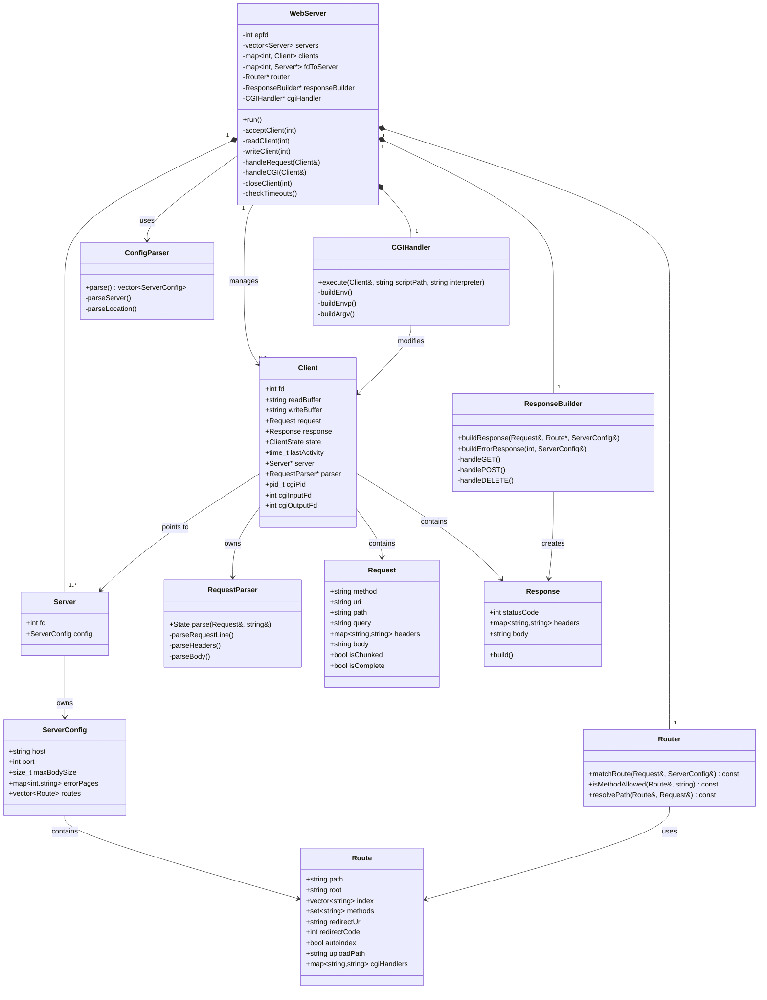
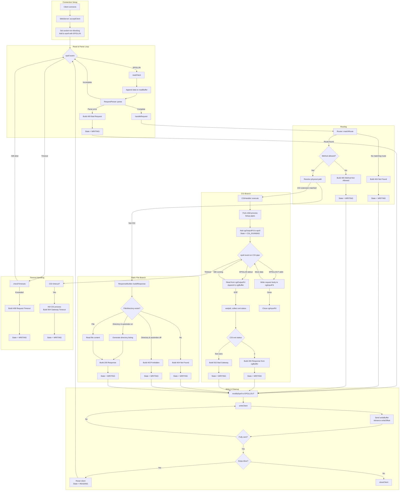

# webserv

# Core classes and relationships diagram

```mermaid
classDiagram
    class WebServer {
        -int epfd
        -vector~Server~ servers
        -map~int, Client~ clients
        -map~int, Server*~ fdToServer
        -Router* router
        -ResponseBuilder* responseBuilder
        -CGIHandler* cgiHandler
        +run()
        -acceptClient(int)
        -readClient(int)
        -writeClient(int)
        -handleRequest(Client&)
        -handleCGI(Client&)
        -closeClient(int)
        -checkTimeouts()
    }

    class Server {
        +int fd
        +ServerConfig config
    }

    class Client {
        +int fd
        +string readBuffer
        +string writeBuffer
        +Request request
        +Response response
        +ClientState state
        +time_t lastActivity
        +Server* server
        +RequestParser* parser
        +pid_t cgiPid
        +int cgiInputFd
        +int cgiOutputFd
    }

    class ServerConfig {
        +string host
        +int port
        +size_t maxBodySize
        +map~int,string~ errorPages
        +vector~Route~ routes
    }

    class Route {
        +string path
        +string root
        +vector~string~ index
        +set~string~ methods
        +string redirectUrl
        +int redirectCode
        +bool autoindex
        +string uploadPath
        +map~string,string~ cgiHandlers
    }

    class RequestParser {
        +State parse(Request&, string&)
        -parseRequestLine()
        -parseHeaders()
        -parseBody()
    }

    class Request {
        +string method
        +string uri
        +string path
        +string query
        +map~string,string~ headers
        +string body
        +bool isChunked
        +bool isComplete
    }

    class ResponseBuilder {
        +buildResponse(Request&, Route*, ServerConfig&)
        +buildErrorResponse(int, ServerConfig&)
        -handleGET()
        -handlePOST()
        -handleDELETE()
    }

    class Response {
        +int statusCode
        +map~string,string~ headers
        +string body
        +build()
    }

    class CGIHandler {
        +execute(Client&, string scriptPath, string interpreter)
        -buildEnv()
        -buildEnvp()
        -buildArgv()
    }

    class Router {
        +matchRoute(Request&, ServerConfig&) const
        +isMethodAllowed(Route&, string) const
        +resolvePath(Route&, Request&) const
    }

    class ConfigParser {
        +parse() vector~ServerConfig~
        -parseServer()
        -parseLocation()
    }

    WebServer "1" *-- "1..*" Server
    WebServer "1" *-- "1" Router
    WebServer "1" *-- "1" ResponseBuilder
    WebServer "1" *-- "1" CGIHandler
    WebServer "1" --> "0..*" Client : manages
    Client --> Server : points to
    Server --> ServerConfig : owns
    ServerConfig --> Route : contains
    Client --> RequestParser : owns
    Client --> Request : contains
    Client --> Response : contains
    WebServer --> ConfigParser : uses
    ResponseBuilder --> Response : creates
    Router --> Route : uses
    CGIHandler --> Client : modifies
```

# Lifecycle diagram

```mermaid
flowchart TD
    subgraph "Connection Setup"
        A[Client connects] --> B[WebServer::acceptClient]
        B --> C[Set socket non-blocking<br/>Add to epoll with EPOLLIN]
    end

    subgraph "Read & Parse Loop"
        C --> D{epoll event}
        D -->|EPOLLIN| E[readClient]
        E --> F[Append data to readBuffer]
        F --> G[RequestParser::parse]
        G -->|"Parse error"| ERR1[Build 400 Bad Request] --> WRITE1[State = WRITING]
        G -->|Incomplete| D
        G -->|Complete| H[handleRequest]
    end

    subgraph "Routing"
        H --> I[Router::matchRoute]
        I -->|"No matching route"| ERR2[Build 404 Not Found] --> WRITE2[State = WRITING]
        I -->|"Route found"| J{Method allowed?}
        J -->|No| ERR3[Build 405 Method Not Allowed] --> WRITE3[State = WRITING]
        J -->|Yes| K[Resolve physical path]
    end

    subgraph "CGI Branch"
        K -->|"CGI extension matched"| L[CGIHandler::execute]
        L --> M[Fork child process<br/>Setup pipes]
        M --> N[Add cgiOutputFd to epoll<br/>State = CGI_RUNNING]
        N --> O{epoll event on CGI pipe}
        O -->|"EPOLLIN stdout"| P[Read from cgiOutputFd<br/>Append to cgiBuffer]
        P -->|"Still running"| O
        P -->|EOF| Q[waitpid, collect exit status]
        O -->|"EPOLLOUT stdin"| R[Write request body to cgiInputFd]
        R -->|"More data"| O
        R -->|Done| S[Close cgiInputFd]
        Q --> T{CGI exit status}
        T -->|0| U[Build 200 Response from cgiBuffer]
        T -->|"Non-zero"| V[Build 502 Bad Gateway]
        U --> WRITE4[State = WRITING]
        V --> WRITE5[State = WRITING]
    end

    subgraph "Static File Branch"
        K -->|"Not CGI"| W[ResponseBuilder::buildResponse]
        W --> X{File/directory exists?}
        X -->|No| ERR4[Build 404 Not Found] --> WRITE6[State = WRITING]
        X -->|"Directory & autoindex off"| ERR5[Build 403 Forbidden] --> WRITE7[State = WRITING]
        X -->|"Directory & autoindex on"| Y[Generate directory listing]
        X -->|File| Z[Read file content]
        Y --> RESP[Build 200 Response]
        Z --> RESP
        RESP --> WRITE8[State = WRITING]
    end

    subgraph "Write & Cleanup"
        WRITE1 & WRITE2 & WRITE3 & WRITE4 & WRITE5 & WRITE6 & WRITE7 & WRITE8 --> AA[modifyEpoll to EPOLLOUT]
        AA --> AB[writeClient]
        AB --> AC[Send writeBuffer<br/>Advance writeOffset]
        AC --> AD{Fully sent?}
        AD -->|No| AB
        AD -->|Yes| AE{Keep-Alive?}
        AE -->|Yes| AF[Reset client<br/>State = READING]
        AF --> D
        AE -->|No| AG[closeClient]
    end

    subgraph "Timeout Handling"
        D -->|Timeout| TO[checkTimeouts]
        TO -->|Exceeded| ERR6[Build 408 Request Timeout] --> WRITE9[State = WRITING]
        TO -->|"Still alive"| D
        O -->|Timeout| TO2[CGI timeout?]
        TO2 -->|Yes| KILL[Kill CGI process<br/>Build 504 Gateway Timeout] --> WRITE10[State = WRITING]
    end
```
