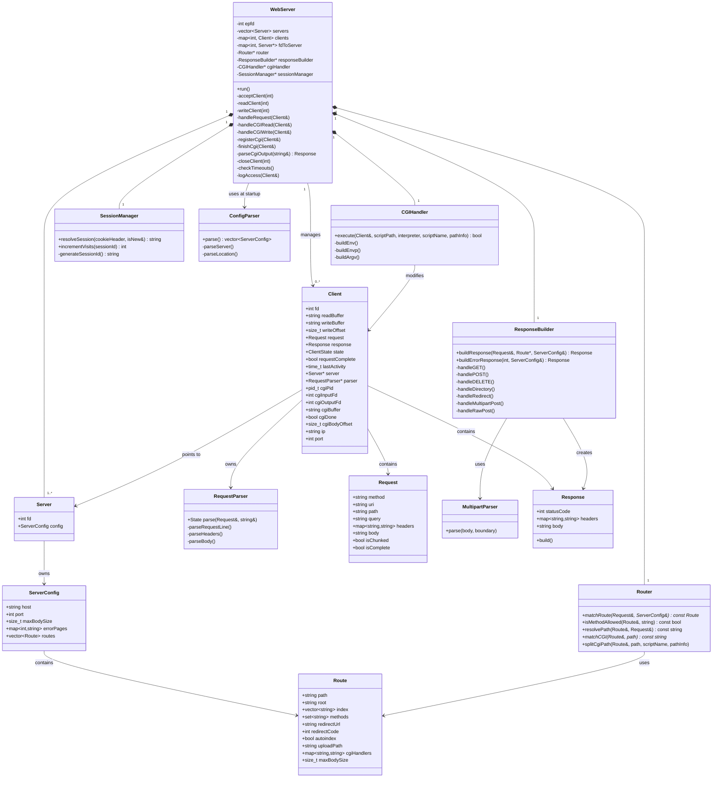
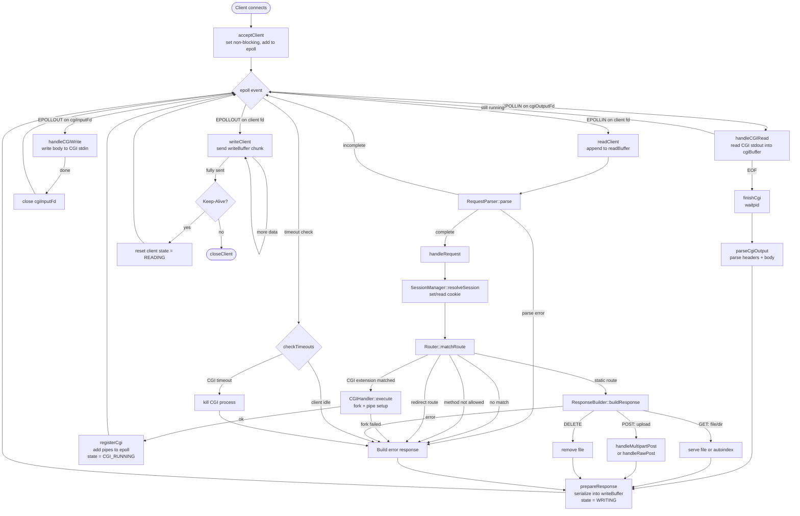

*This project has been created as part of the 42 curriculum by caide-so, marcudos, ancarol9.*
 
# webserv
 
## Description
 
webserv is a fully functional HTTP/1.1 server written in C++98, built as part of the 42 School curriculum. The goal is to implement a real-world web server from scratch — handling multiple simultaneous connections, serving static files, processing CGI scripts, and managing file uploads — without relying on any external libraries.
 
The server is driven by a single `epoll`-based event loop, making all I/O operations non-blocking. It supports virtual hosting via a configuration file inspired by NGINX's `server` block syntax, and implements the `GET`, `POST`, and `DELETE` HTTP methods.
 
Key features:
- Non-blocking I/O with a single `epoll` instance for all sockets and CGI pipes
- Configuration file parser (NGINX-inspired `server`/`location` blocks)
- Static file serving with MIME-type detection
- Directory listing (autoindex)
- File uploads via `POST`
- CGI execution (Python, PHP) with proper environment variable setup
- Chunked transfer encoding (decoding on input)
- Keep-Alive connections
- Configurable error pages, body size limits, and redirects
- Timeout handling for idle clients and runaway CGI processes
## Instructions
 
### Requirements
 
- Linux (uses `epoll`)
- `c++` compiler with C++98 support
- Optional: `python3` and/or `php` for CGI support
### Compilation
 
```bash
make
```
 
This produces the `webserv` binary. The Makefile supports the standard rules: `all`, `clean`, `fclean`, `re`.
 
### Running
 
```bash
./webserv [configuration file]
```
 
If no configuration file is provided, the server defaults to `config/default.conf`.
 
Example:
 
```bash
./webserv config/default.conf
```
 
The default configuration listens on ports **8080** and **8081**.
 
### Running the test suite
 
```bash
make test
```
 
This compiles and runs the unit tests covering the request parser, router, config parser, and response builder.
 
### Configuration file overview
 
The config format is inspired by NGINX. A minimal example:
 
```nginx
server {
    listen 8080;
    root ./www;
    index index.html;
    client_max_body_size 10M;
 
    error_page 404 ./www/error_pages/404.html;
 
    location / {
        allow_methods GET POST DELETE;
        autoindex off;
    }
 
    location /uploads {
        allow_methods GET POST DELETE;
        autoindex on;
        upload_path ./www/uploads;
    }
 
    location /cgi-bin {
        allow_methods GET POST;
        root ./www/cgi-bin;
        cgi .py /usr/bin/python3;
        cgi .php /usr/bin/php-cgi;
    }
 
    location /old {
        allow_methods GET;
        return 301 /;
    }
}
```
 
Supported directives: `listen`, `root`, `index`, `client_max_body_size`, `error_page`, `location`, `allow_methods`, `autoindex`, `upload_path`, `return`, `cgi`.
 
## Architecture

### Core classes and relationships


### Request lifecycle


## Resources
 
### HTTP & Web Server
 
- [RFC 7230 — HTTP/1.1: Message Syntax and Routing](https://datatracker.ietf.org/doc/html/rfc7230)
- [RFC 7231 — HTTP/1.1: Semantics and Content](https://datatracker.ietf.org/doc/html/rfc7231)
- [RFC 3875 — The Common Gateway Interface (CGI/1.1)](https://datatracker.ietf.org/doc/html/rfc3875)
- [MDN Web Docs — HTTP](https://developer.mozilla.org/en-US/docs/Web/HTTP)
- [NGINX Documentation](https://nginx.org/en/docs/)
### Linux I/O & Systems
 
- [`epoll` man page](https://man7.org/linux/man-pages/man7/epoll.7.html)
- [`socket` man page](https://man7.org/linux/man-pages/man2/socket.2.html)
- [Beej's Guide to Network Programming](https://beej.us/guide/bgnet/)
- [The Linux Programming Interface — Michael Kerrisk](https://man7.org/tlpi/)
### C++98
 
- [cppreference.com — C++98 standard library](https://en.cppreference.com/w/)
### Use of AI in this project
 
AI tools (primarily Claude) were used throughout the project in the following ways:
 
- **Code review assistance** — reviewing specific functions for correctness (e.g. chunked body parsing, CGI pipe handling) and catching edge cases before they became runtime bugs.
- **Documentation** — helping draft inline comments and this README.
- **Architecture discussion** — talking through the epoll event loop design and CGI lifecycle to validate the approach before implementation.
All AI-generated suggestions were reviewed, understood, and adapted by the team before being incorporated into the codebase.
